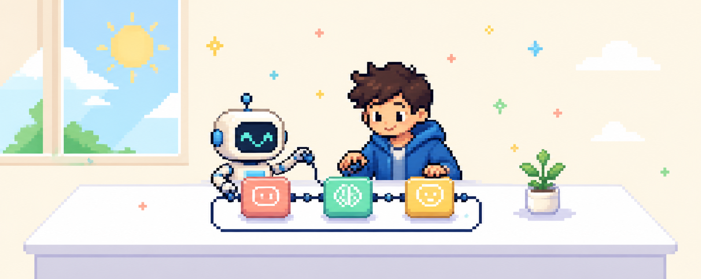
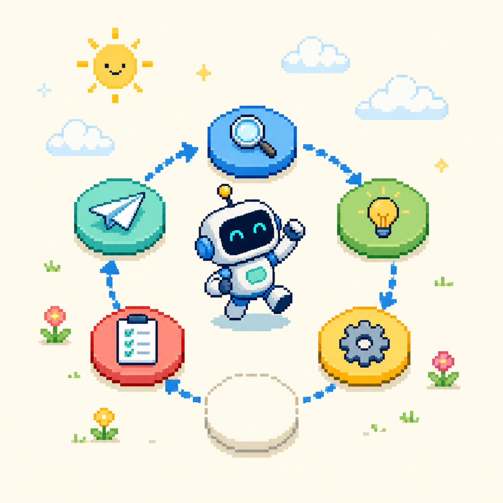
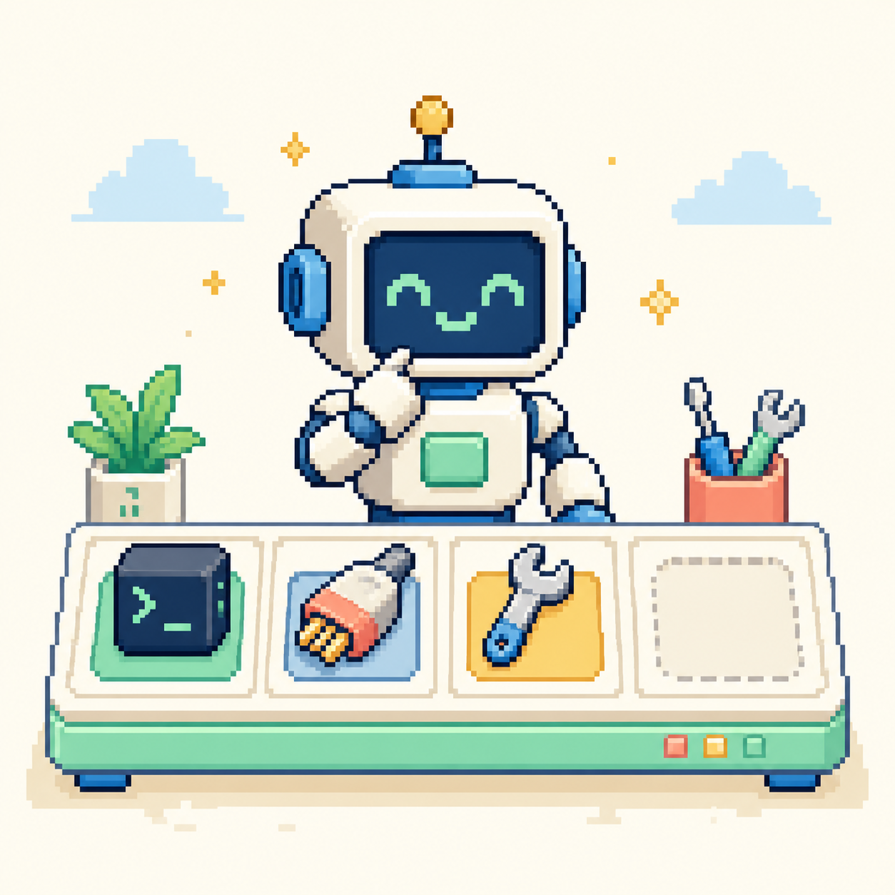
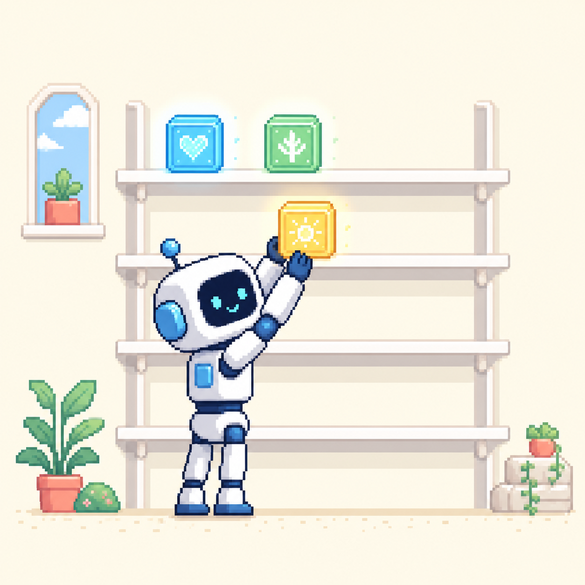

  
  

## Hi, I'm PeaceMaker

I build and explore **agent systems** — how they plan, use tools, remember useful context, verify results, and turn intent into action.

This profile is a small, open workshop for practical experiments and ideas that are still becoming real systems.

## What I'm Exploring

<table>
  <tr>
    <td width="33%" valign="top">
      <h3>Agent Loops</h3>
      
Planning, execution, reflection, evaluation, and the engineering that keeps the loop reliable.

    </td>
    <td width="33%" valign="top">
      <h3>Real Tools</h3>
      
Connecting agents to APIs, data, workflows, and useful actions beyond the chat box.

    </td>
    <td width="33%" valign="top">
      <h3>Useful Memory</h3>
      
RAG, retrieval, context design, and remembering the right things at the right moment.

    </td>
  </tr>
</table>

## Visual Log

<table>
  <tr>
    <td width="33%" valign="top">
      
      
<code>close the loop</code>

    </td>
    <td width="33%" valign="top">
      
      
<code>use real tools</code>

    </td>
    <td width="33%" valign="top">
      
      
<code>remember what matters</code>

    </td>
  </tr>
</table>

## Open-source work

In 2026, I've landed **6 merged pull requests across two GitHub accounts** in open-source repositories I don't own. Recent work spans frontend performance, authorization safety, skill installation, provider configuration, event-history integrity, and desktop reliability.

### [bytedance/deer-flow](https://github.com/bytedance/deer-flow)

Five merged pull requests across `PeaceMaker-best` and `Beautyl0ve`, covering chat-state performance, sandbox authorization checks, local skill archives, configurable podcast voices, and reliable history attribution.

### [makecindy/cindy](https://github.com/makecindy/cindy)

A merged desktop reliability fix that removes stale timestamp residue from the interface.

[Browse merged PRs from PeaceMaker-best](https://github.com/search?q=author%3APeaceMaker-best+is%3Apr+is%3Amerged+-user%3APeaceMaker-best+merged%3A%3E%3D2026-01-01&type=pullrequests) · [Browse merged PRs from Beautyl0ve](https://github.com/search?q=author%3ABeautyl0ve+is%3Apr+is%3Amerged+-user%3ABeautyl0ve+merged%3A%3E%3D2026-01-01&type=pullrequests)

## The Big Vision

### Agent 还有很多没做完。

There are still better ways for agents to plan, collaborate, use tools, remember, verify their work, and recover when reality does not match the plan.

I want to build some of those missing pieces — one clear, useful, working system at a time.

Keep it useful. Keep it verifiable. Keep building.

